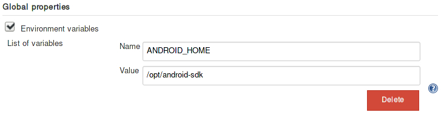
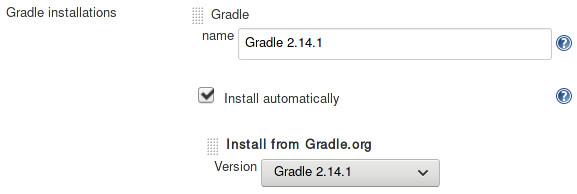
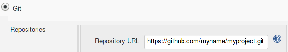
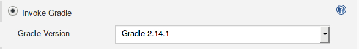

	<h1 id="jenkins">Jenkins: reminder</h1>
	

Creation: {{ page.date | date: "%m/%d/%Y" }}

### ~ Setup Jenkins:  

Install `jenkins` then start and enable the service.  
Go to jenkins default URL `http://localhost:8090` and follow the instructions.  
The following plugins may be needed:

* Gradle plugin *(if using gradle)*
* Git plugin *(if using git)*
* filesystem_scm plugin *(if using local project)*  

 

### ~ Setup your Android project:  
 * **Step 1. Check your SDK path:**  
 Jenkins needs to access your android SDK and will check the path into your project *local.properties* file. Otherwise, you need to set up manually the `ANDROID_HOME` environment variable via `Manage Jenkins > Configure System`. Then, inside the *Gobal properties* section, set up your variable:

 
 * **Step 2. Install gradle:**  
Go to `Manage Jenkins > Global Tool Configuration` then, in the *Git* section, install your project gradle version.

 
 

 * **Step 3. Create your jenkins item:**  
 Setup your project via `New Item > Freestyle project` then configure it.  
For example, with a github project, the basic configuration is:

*Note: If the gradle version used is not the right, the build output will tell you the gradle version expected.*

 

### ~ Build and output:
* To build your project manually, go to `My Views > your-project > Build Now`.  
* To check the build output, click on the build name then `Console Output`.